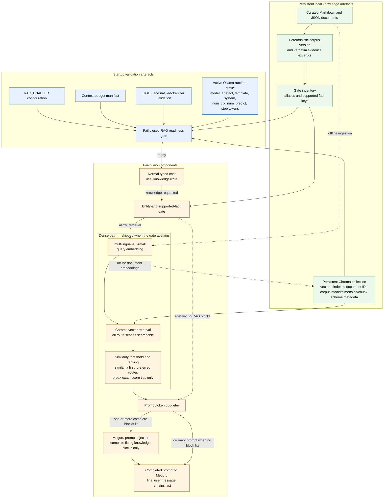
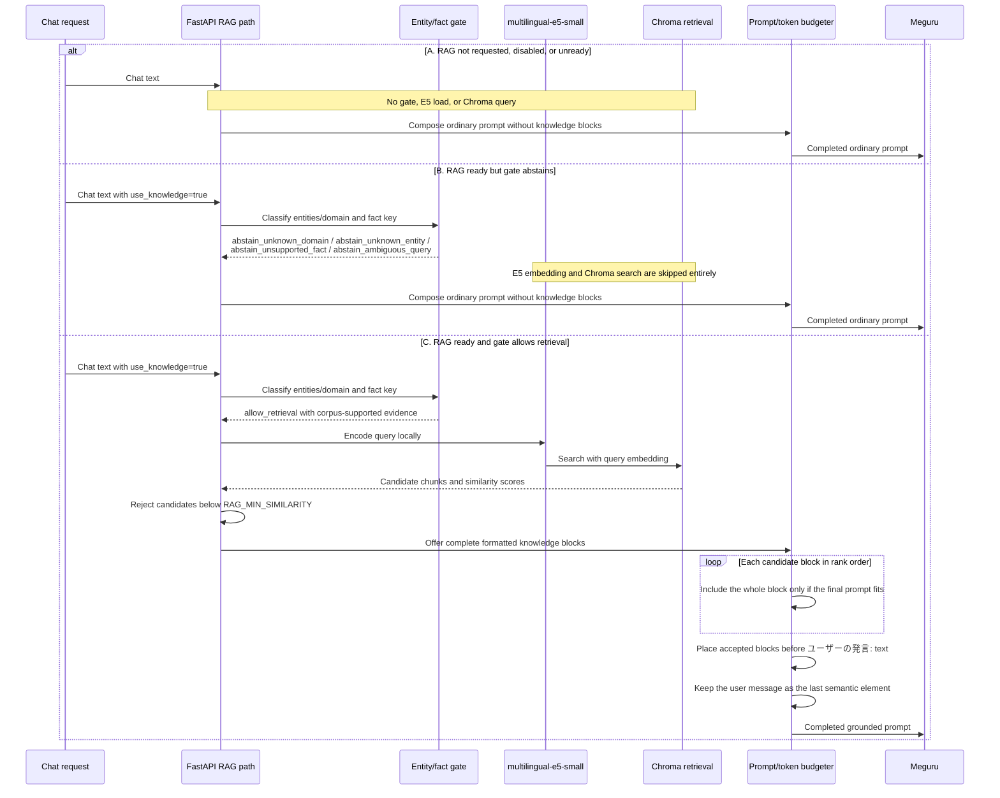

# InabaPet Local RAG Architecture

## 1. Small RAG component diagram



The blue area is validated once at startup, the green area persists locally, and the orange area runs per query. On abstention, the dashed path bypasses E5, Chroma search, and knowledge-block injection.

## 2. Startup readiness sequence diagram

```mermaid
sequenceDiagram
    participant Config as Configuration
    participant Startup as FastAPI startup
    participant Manifest as Context manifest
    participant GGUF as GGUF tokenizer
    participant Ollama as Ollama /api/show
    participant Corpus as Configured corpus
    participant Inventory as Gate inventory
    participant Chroma as Chroma identity reader
    participant Chat as Ordinary chat

    Startup->>Config: Read RAG_ENABLED
    alt RAG_ENABLED is false
        Startup->>Startup: disabled_by_config
    else RAG_ENABLED is true
        Startup->>Manifest: Require schema v2 and validation.status = passed
        Startup->>GGUF: Verify GGUF hash and gguf_native tokenizer mode
        Startup->>Ollama: Read authoritative active model/profile
        Startup->>Startup: Compare model and artefact identity,
        Note over Startup,Ollama: template/system hashes, num_ctx, num_predict,<br/>and canonical stop-token settings must match
        alt Context evidence is missing, stale, or invalid
            Startup->>Startup: Stable context-readiness reason; RAG off
        else Context evidence matches
            Startup->>Corpus: Load exact configured RAG_CORPUS_PATH and compute version
            Startup->>Inventory: Require matching corpus path and corpus_version
            Startup->>Inventory: Validate aliases, fact keys, evidence excerpts,
            Note over Corpus,Inventory: Every evidence excerpt must occur verbatim in its<br/>referenced document, and every referenced ID must exist
            alt Corpus or inventory evidence is invalid
                Startup->>Startup: Stable gate-readiness reason; RAG off
            else Corpus and inventory match
                Startup->>Chroma: Open collection without an embedding function
                Chroma-->>Startup: Collection metadata and evidence-referenced document IDs
                Startup->>Startup: Verify ready index state, corpus_version,<br/>embedding identity/dimension, chunk schema/settings,<br/>and required indexed document IDs
                alt Collection identity is missing or mismatched
                    Startup->>Startup: Stable gate_index_* reason; RAG off
                else All startup evidence matches
                    Startup->>Startup: ready
                end
            end
        end
    end
    Startup-->>Chat: Ordinary chat remains available in every outcome
```

Readiness is a startup snapshot. Its output is either `ready` or a stable fail-closed reason such as `manifest_missing`, `gguf_mismatch`, `template_mismatch`, `gate_corpus_mismatch`, or `gate_index_corpus_mismatch`; detailed local values are not needed by the query path.

## 3. Per-query RAG sequence diagram



## 4. Short explanation

Dense similarity answers “which chunk is nearest to this query,” not “does the corpus support the requested fact.” A birthday or favourite-food question can therefore rank a Meguru profile highly even when that profile contains neither fact; unrelated queries also always have a nearest vector. The dense threshold alone could not reliably separate those cases from supported questions.

The entity-and-supported-fact gate is a small, inspectable precondition for dense retrieval. It allows retrieval only when the query resolves to a known corpus entity or domain and a fact key that the inventory declares as supported. Each declaration requires a verbatim excerpt from a referenced corpus document. This prevents aliases, metadata, or assumptions about the game from being mistaken for evidence, and makes changed or removed evidence detectable at startup.

The active corpus version, the gate inventory's `corpus_version`, and the Chroma collection's `corpus_version` must be identical. Chroma's embedding identity and dimension, chunk schema/settings, and required document IDs must also match. These checks prevent a valid-looking inventory from authorising retrieval against stale chunks or a differently embedded corpus.

The four decision points are distinct:

- **RAG enabled** means configuration requests RAG with `RAG_ENABLED=true`.
- **RAG ready** means every context, corpus, inventory, and index startup check passed.
- **Gate allows retrieval** means this query maps to a corpus-supported entity/domain and fact key.
- **Dense retrieval finds a relevant chunk** means E5 and Chroma returned a candidate that passed the configured similarity threshold; it may still be omitted if no complete block fits the prompt budget.

Abstention is a successful safety outcome: the system has determined that curated knowledge should not be asserted, so it skips E5 and Chroma and continues normal chat. RAG failures likewise fail closed by contributing no knowledge. Ordinary chat fails open because its prompt construction and Meguru response path remain available even when every optional RAG layer is disabled, unready, abstaining, unavailable, or unable to fit a block.
